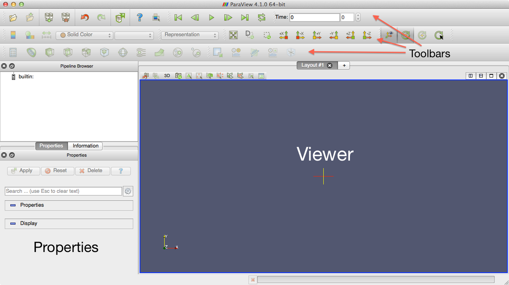
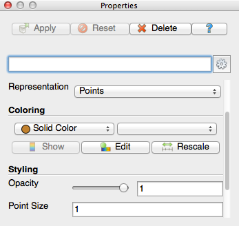
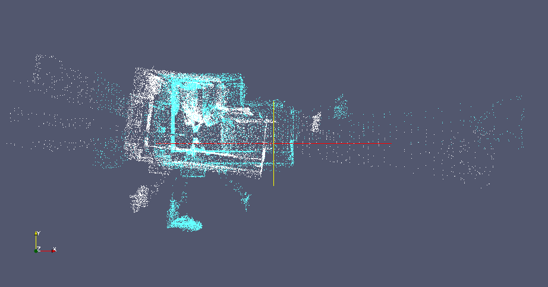
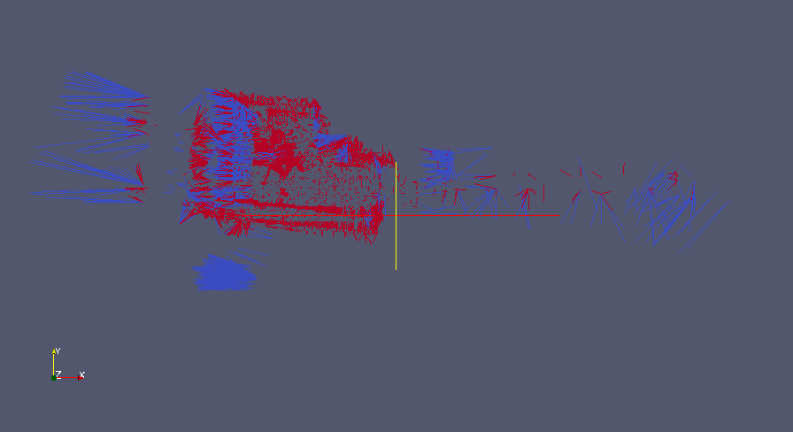
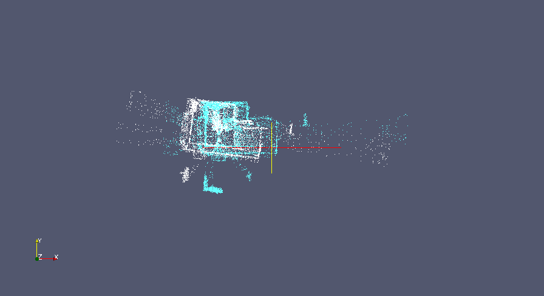

| [Tutorials Home](index.md) | [Previous](OutlierFiltersFamilies.md) | [Next](DefaultICPConfig.md) |
| :--- | :---: | ---: |

# An Introduction to ICP Registration

In the following tutorial, we will perform an ICP registration on an example dataset.  Throughout this tutorial, we will be making use of the `pmicp` executable, which can be found in the `examples` directory of your libpointmatcher build directory (i.e., `build/examples/pmicp`).

## Prerequisite: Installing Paraview

To visualize the pointclouds and what happens to them during the different steps of the ICP pipeline, you need to install a visualization program.  [Paraview](http://www.paraview.org/) is a widely used data analysis and visualization program.  If you do not have it on your system, we suggest to download and install it from [this link](http://www.paraview.org/download/).

## Example Dataset: Point Cloud Scan of an Appartment

|Figure 1: Floor plan of the scanned apartment|
|:------------|
||

The data for this tutorial is taken from the apartment dataset available for [download](http://projects.asl.ethz.ch/datasets/doku.php?id=laserregistration:apartment:home) from the ASL at ETH Zurich.  The dataset is useful for testing registration robustness in dynamic environments.  Dynamic environments (i.e., where objects move during the scan) hinder registration as they produce many outlier points which cannot be matched between different scans.

A top-down view of the point cloud is depicted below, with the colors showing vertical elevation.  The ceiling has been removed from the point cloud such that the floor (in blue) and the walls (in red) are clearly visible.  Note that the coordinate origin is placed in the kitchen at the starting point of data capture, which is in the top-left of the top-down view and floor plan.

|Figure 2: Top-down view of a global scan of the apartment|
|:------------|
||

## Visualizing a Point Cloud in Paraview

We will now open the example point clouds for viewing in paraview.  The two views from the apartment dataset can be found in [examples/icp_tutorial/cloud_0.vtk](https://github.com/ethz-asl/libpointmatcher/blob/master/examples/icp_tutorial/cloud_0.vtk) and [examples/icp_tutorial/cloud_1.vtk](https://github.com/ethz-asl/libpointmatcher/blob/master/examples/icp_tutorial/cloud_1.vtk).  Open Paraview and you will be greeted by the following window:

### The Paraview Main Window

|Figure 3: Main window of Paraview|
|:------------|
||

On the top, you will see three toolbars.  The first is for importing/exporting data, the second for navigating a representation of your data, and the last for manipulating the data.

On the top-left, you can find a pipeline browser which displays the various "layers" of data that will be present.  Paraview allows you to import several datasets, as well as create new ones.  These datasets are layered in the pipeline and displayed in the viewer on the right.

On the bottom-left you can find options for editing properties, and retrieving information about a given layer.

### Opening the Point Clouds in Paraview

Go to File -> Open and open [examples/icp_tutorial/cloud_0.vtk](https://github.com/ethz-asl/libpointmatcher/blob/master/examples/icp_tutorial/cloud_0.vtk).  Don't forget to click the apply button in the properties pane in order to load the point cloud into the viewer.  Now, we will change some properties of the point cloud to make it easer to visualize in the viewer.  In the properties pane, change the representation style from surface to points, and change the point size to 1.

|Figure 4: Point properties window of Paraview|
|:------------|
||

You can click and drag in the viewer pane to navigate the 3D environment.

You can then open the second view in [examples/icp_tutorial/cloud_1.vtk](https://github.com/ethz-asl/libpointmatcher/blob/master/examples/icp_tutorial/cloud_1.vtk).  Change the representation to points and change the color to blue so that the second point cloud is visible over the first.  You can see that both point clouds represent the same scene but do not have the same number of points and are misaligned.  ICP registration will be used to find a transformation which best aligns the points from the first point cloud to the second, while being robust to the differences or outliers between the two views.

|Figure 5: The two point clouds of the apartment scene used in this tutorial.  The reading is colored white and the reference blue.|
|:------------|
||

You can also import a sequence of point clouds and play them as a video.  If a folder contains point clouds with the same prefix (e.g., cloud_0.vtk, cloud_1.vtk ... cloud_N.vtk), they are grouped in the file open dialog.  You can then play back the sequence by clicking the play button in the top toolbar.

### An Empty ICP Configuration

In libpointmatcher, configurations are stored in YAML files.  For more information, refer to the [configuration tutorial](Configuration.md).  For the purpose of this tutorial, we will start with a simplistic configuration file stored in [examples/icp_tutorial/icp_tutorial_empty.yaml](https://github.com/ethz-asl/libpointmatcher/blob/master/examples/icp_tutorial/icp_tutorial_empty.yaml).  The configuration is shown below.

```yaml
readingDataPointsFilters:
   - IdentityDataPointsFilter

referenceDataPointsFilters:
  - IdentityDataPointsFilter

matcher:
 KDTreeMatcher

outlierFilters:
   - NullOutlierFilter

errorMinimizer:
   IdentityErrorMinimizer

transformationCheckers:
   - CounterTransformationChecker

inspector:
   NullInspector

logger:
   FileLogger
```


For now, the configuration is essentially empty.  Both the reading and reference point clouds are filtered using an identity data filter, which does nothing to the point clouds.  In the matching step, a kd-tree is used to find the closest points from the reading to the reference point cloud.  No outliers are removed by the null outlier filter, and the identity error minimizer simply returns an identity transformation, no matter what the input point clouds are.  The transformation are monitor with a counter, which will exit the iterative process after a fix number of iteration (i.e., in that case the default value is used, which is 40 iterations).

The last two pieces in the configuration are used for logging and inspecting the algorithm as it runs.  The inspector is disable and won't do any thing, while the logger will print information on the consol (i.e., it's default behavior). More precisely, the file logger can be used to outputs information about the algorithm's run status to the console, or to a file if it has been specified.  

This configuration file won't do much in term of registration, but it is useful to explicit the structure of a solution configuration. In the following steps, we will replace the empty components with more useful ones.

You can run the registration program with this empty configuration to see what it does.  If you have built libpointmatcher in `/build` subdirectory, you can use the following commands:

```bash
$ cd libpointmatcher/examples/icp_tutorial/
$ ../../build/examples/pmicp -v --config icp_tutorial_empty.yaml cloud_0.vtk cloud_1.vtk
```

You should see the following results in your console:

```text
* KDTreeMatcher: initialized with knn=1, epsilon=0, searchType=1 and maxDist=inf
Applying 1 DataPoints filters - 24989 points in
* unknown - 24989 points out (-0%)
Applied 1 filters - 24989 points out (-0%)
PointMatcher::icp - reference pre-processing took 0.00443294 [s]
Applying 1 DataPoints filters - 25193 points in
* unknown - 25193 points out (-0%)
Applied 1 filters - 25193 points out (-0%)
PointMatcher::icp - reading pre-processing took 0.00072264 [s]
PointMatcher::icp - 40 iterations took 1.66783 [s]
match ratio: 1
writing to test_ref.vtk
writing to test_data_in.vtk
writing to test_data_out.vtk
ICP transformation:
1 0 0 0
0 1 0 0
0 0 1 0
0 0 0 1
```

Additionally, 3 files: `test_ref.vtk`, `test_data_in.vtk`, and `test_data_out.vtk` are written to the current directory.  The first two represent the reference and reading respective point clouds and are identical to `cloud_0.vtk` and `cloud_1.vtk`.  `test_data_out.vtk` is the result of transforming the reading point cloud so that it best aligns the reference.  Because this empty configuration does not perform any alignment, the output point cloud is identical to the reading point cloud. 

### A Real ICP Configuration

We will now replace the empty configuration with something which makes more sense for registration.  We will use the second configuration file of our tutorial folder [examples/icp_tutorial/icp_tutorial_cfg.yaml](https://github.com/ethz-asl/libpointmatcher/blob/master/examples/icp_tutorial/icp_tutorial_cfg.yaml), which contain the following:

```yaml
readingDataPointsFilters:
  - RandomSamplingDataPointsFilter:
      prob: 0.5

referenceDataPointsFilters:
  - SamplingSurfaceNormalDataPointsFilter:
      knn: 10

matcher:
  KDTreeMatcher:
    knn: 1

outlierFilters:
  - TrimmedDistOutlierFilter:
      ratio: 0.9

errorMinimizer:
  PointToPlaneErrorMinimizer

transformationCheckers:
  - CounterTransformationChecker:
      maxIterationCount: 40
  - DifferentialTransformationChecker:
      minDiffRotErr: 0.001
      minDiffTransErr: 0.01
      smoothLength: 4 

inspector:
  VTKFileInspector:
     baseFileName : vissteps
     dumpDataLinks : 1
     dumpReading : 1
     dumpReference : 1

logger:
  FileLogger
```

#### Data Filters

We apply some filtering to both the reading and reference point clouds in order to reduce the number of points and thus decrease the computation time of each iteration.  Half of the reading points are sampled randomly, and points are sampled from the reference based wil extracting their surface normal. In that case, the parameter knn will reduce the number of points by a factor 10. For more information, see [here](DataFilters.md#samplingnormhead).

#### Matcher

Points in the filtered reading cloud are first transformed with the current transformation parameters and are then matched to their nearest neighbors in the filtered reference cloud.  The method used for matching is based on a kd-tree, which produce an optimal search at a lower computation complexity.

#### Outlier Filter

Once points have been matched and are linked, the outlier filter step attempts to remove links which do not correspond to true point correspondences.  The trimmed distance outlier filter does so by sorting links by their distance.  Points that are matched with a closer distance are less likely to be outliers.  The high distance matches in the upper 10% quantile are rejected.

We also changed the inspector to save information in vtk format. The `dumpDataLinks` option is set in the `VTKInspector` to visualize how the links between matched points evolve in time.  After running the example, you will be able to open the `vissteps-link-*.vtk` in Paraview to see those links.  They are colored by the distance with closer matches being colored red and outliers colored blue.  You can see that the matches get closer as the iterations increase.  

|Figure 6: Animation of the point correspondences iteration by iterations.  The links are colored by distance, with the red links having a lower norm than the blue links |
|:------|
||

#### Error Minimizer

The point to plane error minimizer is used since there is a high degree of geometrical structure in this dataset.  We mean by geometrical structure the fact that there are many planar geometric surfaces in the apartment in contrast with smoother surfaces which might be associated with a terrain.

#### Transformation checkers

In addition to a limit on the total number of iterations, an additional constraint is added to the transformations.  A threshold on the rotational and translational relative transformation changes is defined between iterations.  These values are smoothed with the `smoothLength` parameter by taking the averages of these changes every 4 iterations.  If the change in the transformation is below this threshold, the algorithm is stopped.  This is to enforce convergence towards a local optimum and to prevent oscillations.

#### Inspectors

We activate the generation of point cloud visualizations in the VTK inspector.  The reading, reference, and match links will be saved at each iteration of the registration process.  These can then be loaded into Paraview.

#### Running new configuration

You can run the ICP registration with this new configuration with the following:

```bash
$ ../../build/examples/pmicp -v --config icp_tutorial_cfg.yaml cloud_0.vtk cloud_1.vtk
```

You should now see the following outputs to the console. We will break them down into steps.  

```text
* KDTreeMatcher: initialized with knn=1, epsilon=0, searchType=1 and maxDist=inf
Applying 1 DataPoints filters - 36674 points in
* SamplingSurfaceNormalDataPointsFilter - 18505 points out (-49.5419%)
Applied 1 filters - 18505 points out (-49.5419%)
PointMatcher::icp - reference pre-processing took 0.0222968 [s]
Applying 1 DataPoints filters - 36670 points in
* RandomSamplingDataPointsFilter - 18280 points out (-50.15%)
Applied 1 filters - 18280 points out (-50.15%)
PointMatcher::icp - reading pre-processing took 0.00116747 [s]
PointMatcher::icp - 34 iterations took 9.28363 [s]
match ratio: 0.900055
writing to test_ref.vtk
writing to test_data_in.vtk
writing to test_data_out.vtk
ICP transformation:
   0.993552   -0.113149  0.00713103     0.60831
   0.113181    0.993565 -0.00425984 -0.00387758
-0.00660312  0.00503951    0.999965   0.0107267
          0           0           0           1
```


First the matcher is initialized:

```text
* KDTreeMatcher: initialized with knn=1, epsilon=0, searchType=1 and maxDist=inf
```

Next, the data filters are applied to the reading and reference point clouds with both halving the number of points in the original point clouds.  Notice that the sampling surface normal filter is significantly more computationally intense due to the calculation of surface normals.

```text
Applying 1 DataPoints filters - 36674 points in
* SamplingSurfaceNormalDataPointsFilter - 18505 points out (-49.5419%)
Applied 1 filters - 18505 points out (-49.5419%)
PointMatcher::icp - reference pre-processing took 0.0222968 [s]
Applying 1 DataPoints filters - 36670 points in
* RandomSamplingDataPointsFilter - 18280 points out (-50.15%)
Applied 1 filters - 18280 points out (-50.15%)
PointMatcher::icp - reading pre-processing took 0.00116747 [s]
```

We then enter in the iterative section of the registration algorithm.  The algorithm completes after 34 iterations, with each iteration slightly improving the point cloud alignment alignment.  At the termination of the algorithm, 90% of the points are matched and the resulting transformation matrix is displayed on the console.

```text
PointMatcher::icp - 34 iterations took 9.28363 [s]
match ratio: 0.900055
writing to test_ref.vtk
writing to test_data_in.vtk
writing to test_data_out.vtk
ICP transformation:
   0.993552   -0.113149  0.00713103     0.60831
   0.113181    0.993565 -0.00425984 -0.00387758
-0.00660312  0.00503951    0.999965   0.0107267
          0           0           0           1
```

In the following animation, you can observe the reading point cloud being transformed as each iteration further refines the alignment with the reference.

|Figure 7: Animation of the reading cloud aligning with the reference|
|:------------|


### Bonus Tip

The executable `pmicp` can output the list of all the modules you can load in the yaml file along with their parameters and default values. You can see those using:

```bash
$ ./pmicp -l
```

If you are searching for the documentation of a particular module, you can do:

```bash
$ ./pmicp -l | awk '/<name>/' RS="\n\n" ORS="\n\n"
```

where you need to replace `<name>` by the module name. For example:

```bash
$ ./pmicp -l | awk '/VoxelGridDataPointsFilter/' RS="\n\n" ORS="\n\n"
```

Will output:

```text
VoxelGridDataPointsFilter
Construct Voxel grid of the point cloud. Down-sample by taking centroid or center of grid cells.
- vSizeX (default: 1.0) - Dimension of each voxel cell in x direction - min: -inf - max: inf
- vSizeY (default: 1.0) - Dimension of each voxel cell in y direction - min: -inf - max: inf
- vSizeZ (default: 1.0) - Dimension of each voxel cell in z direction - min: -inf - max: inf
- useCentroid (default: 1) - If 1 (true), down-sample by using centroid of voxel cell.  If false (0), use center of voxel cell. - min: 0 - max: 1
- averageExistingDescriptors (default: 1) - whether the filter keep the existing point descriptors and average them or should it drop them - min: 0 - max: 1
```

### Where to go from here

To learn more on how to create configurations for libpointmatcher, move to the [next tutorial](Configuration.md).  Feel free to modify the configuration given above, adding and modifying filters and seeing how they impact the registration performance.
